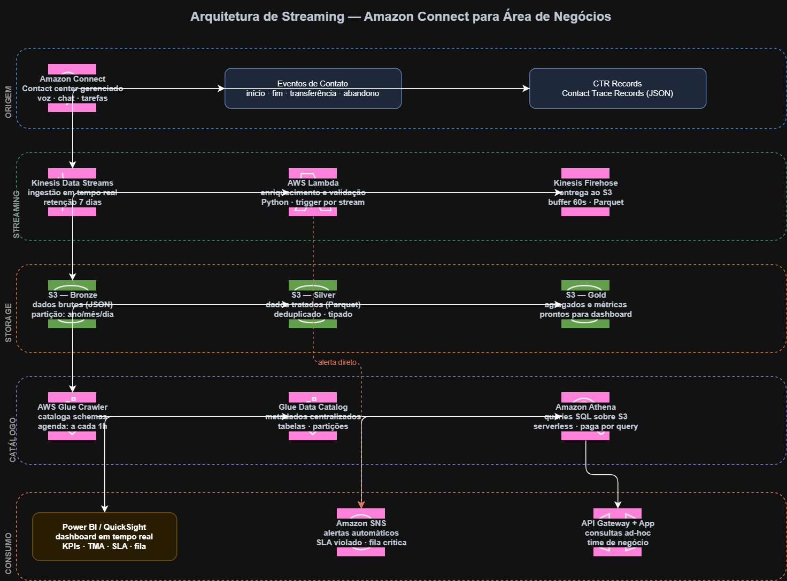

# Arquitetura de Streaming — Amazon Connect para Área de Negócios

Diagrama de arquitetura de dados em tempo real que mostra como eventos de um contact center bancário são capturados, processados e entregues como KPIs operacionais para a área de negócios — com latência de menos de 60 segundos.

---

## O diagrama

---

## O problema que este projeto resolve

Contact centers bancários e de fintechs geram milhares de eventos por hora: chamadas iniciadas, abandonadas, transferidas, finalizadas. Sem uma arquitetura de dados adequada, gestores só conseguem visualizar métricas do dia anterior — tarde demais para agir em picos de volume, SLAs violados ou filas críticas.

Esta arquitetura transforma eventos brutos do contact center em insights disponíveis em menos de 60 segundos, entregando KPIs em tempo real para supervisores e diretores de operações.

---

## As 5 camadas da arquitetura

**1. Origem — Amazon Connect**
Contact center gerenciado pela AWS. Emite eventos de contato em tempo real: início de chamada, fim, transferência e abandono. Suporta voz, chat e tarefas em um único serviço.

**2. Streaming — Kinesis + Lambda**
O Kinesis Data Streams captura os eventos em tempo real e os mantém disponíveis por 7 dias — permitindo replay em caso de falha. O Lambda processa cada evento, enriquece com informações adicionais e o encaminha para o storage. O Kinesis Firehose entrega os dados ao S3 automaticamente, convertendo para Parquet.

**3. Storage — S3 (Bronze / Silver / Gold)**
Os dados passam por três camadas:
- **Bronze**: dados brutos, exatamente como chegaram
- **Silver**: dados limpos e padronizados
- **Gold**: agregados e métricas prontos para dashboard

**4. Catálogo — Glue + Athena**
O Glue Crawler cataloga automaticamente os dados do S3 a cada hora. O Athena permite consultas SQL direto nos arquivos — sem precisar de banco de dados, sem custo fixo.

**5. Consumo — Dashboard + Alertas**
Power BI ou QuickSight conectam no Athena e exibem os KPIs atualizados em tempo real. O SNS dispara alertas automáticos quando SLAs são violados ou filas atingem o limite crítico.

---

## Por que cada serviço foi escolhido

| Decisão | Alternativa considerada | Por que esta escolha |
|---|---|---|
| Kinesis vs SQS | SQS | Kinesis suporta múltiplos consumidores simultâneos e retém dados por 7 dias para replay |
| Parquet vs CSV | CSV | 63% menor em tamanho, queries até 9x mais rápidas, tipos de dados preservados |
| Athena vs Redshift | Redshift | Athena é serverless e paga por query — Redshift seria superdimensionado para este volume |
| Lambda vs EC2 | EC2 | Lambda escala automaticamente com o volume de chamadas, custo zero em horários ociosos |

---

## KPIs entregues pelo dashboard

| KPI | Descrição | Atualização |
|---|---|---|
| TMA | Tempo Médio de Atendimento por fila e agente | Tempo real |
| TME | Tempo Médio de Espera até atendimento | Tempo real |
| Taxa de Abandono | % de contatos encerrados antes do atendimento | Tempo real |
| SLA | % de contatos atendidos dentro do tempo contratado | Acumulado do dia |
| Ocupação de Agentes | % do tempo em atendimento vs. disponível | Tempo real |
| Contatos em Fila | Volume atual por fila de atendimento | Tempo real |

---

## Estimativa de custo (100k contatos/mês)

| Serviço | Custo estimado |
|---|---|
| Kinesis Data Streams | ~$21/mês |
| AWS Lambda | ~$1,80/mês |
| Kinesis Firehose | ~$0,25/mês |
| S3 (20 GB) | ~$0,46/mês |
| Glue Crawler | ~$0,66/mês |
| Athena | ~$0,25/mês |
| **Total** | **~$24/mês** |

---

## Estrutura do repositório

aws-connect-streaming/
├── diagrams/
│ ├── architecture-main.png → diagrama exportado (alta resolução)
│ └── architecture-main.drawio → fonte editável no draw.io
├── docs/ → documentação adicional
└── README.md

---

## Autor

**Daniel Machado**
Analista de Dados | SQL · Python · Power BI · AWS | Mercado Financeiro

